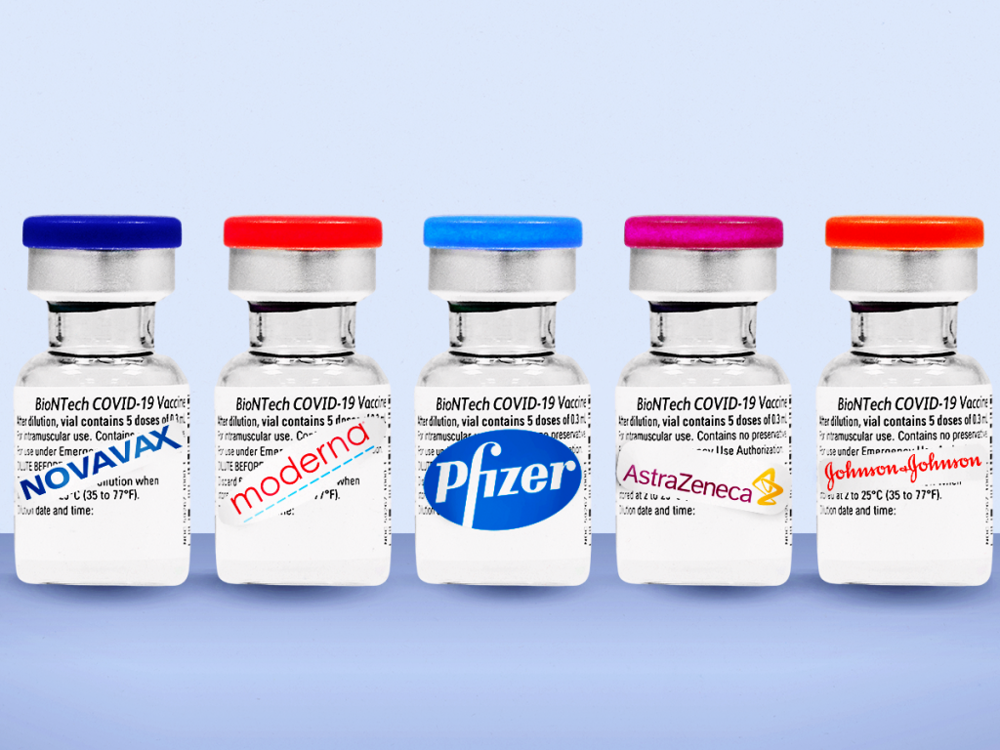

# Are Some COVID-19 Vaccines More Effective Than Others?

**COVID-19 vaccines** rolling out around the world weren't compared to each other in studies, so it's hard to tell how they might differ in effectiveness. Experts say the vaccines are alike on what matters most: _preventing hospitalizations and deaths._ The CDC urges people to get whatever vaccine they can.

> "Real-world evidence as millions of people receive the vaccines show they're all working very well. Still, people might wonder if one is better than another since studies conducted before the vaccines were rolled out found varying levels of effectiveness. The problem is they don't offer apples-to-apples comparisons." -[US News](https://www.usnews.com/news/health-news/articles/2021-04-08/are-some-covid-19-vaccines-more-effective-than-others)

Around the world, hospitalizations are dropping in countries where vaccines have been rolling out including Israel, England and Scotland — regardless of which shots are given. And the U.S. government’s first look at real-world data among essential workers provided further evidence that the Pfizer and Moderna vaccines are highly protective -- 90% -- against infections whether there were symptoms or not.

  
 
- The Pfizer and Moderna vaccines use messenger RNA, while the Johnson and Johnson vaccine uses the viral vectored vaccine process, utilizing an altered adenovirus. -[StatNews](https://www.statnews.com/2021/02/02/comparing-the-covid-19-vaccines-developed-by-pfizer-moderna-and-johnson-johnson/) - The best covid vaccine is whichever one you can get, and no one should wait for a specific vaccine. All three are safe, effective, and reduce risk of severe illness. -[CDC](https://www.cdc.gov/coronavirus/2019-ncov/vaccines/different-vaccines.html) - The Johnson and Johnson vaccine seems to have the least possible side effects, with Moderna having the most. This obviously differes for everyone, but this seems to be the general idea. -[Mayo Clinic](https://www.mayoclinic.org/coronavirus-covid-19/vaccine/comparing-vaccines)